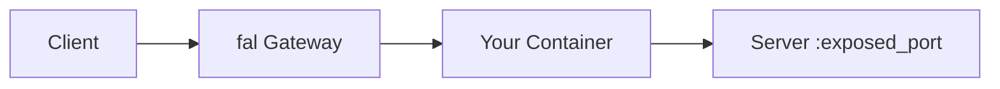
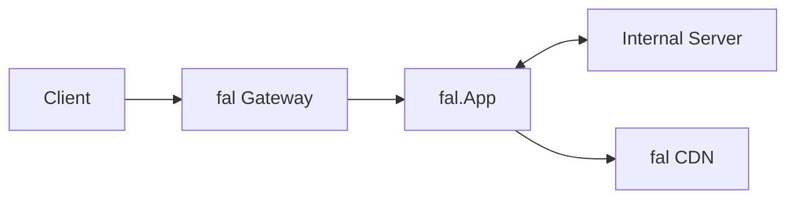

> ## Documentation Index
> Fetch the complete documentation index at: https://fal.ai/docs/llms.txt
> Use this file to discover all available pages before exploring further.

# Migrate an External Docker Server

> Deploy an existing Docker-based server (ComfyUI, custom APIs) to fal's serverless platform.

If you already have a working Docker container that runs a server, you can deploy it on fal with minimal changes. This guide covers two approaches: exposing your server's port directly for zero-code migration, or wrapping it with a `fal.App` proxy for full control over the API surface. Both approaches give you autoscaling, [analytics](/documentation/serverless/observability/app-analytics), and the same infrastructure that powers every model in the marketplace.

This is the fastest path for teams migrating from self-hosted infrastructure, Kubernetes, or other serverless platforms. Your existing server code stays unchanged. You just need to define a [Dockerfile](/documentation/development/use-custom-container-image) (or reference an existing image from a [private registry](/documentation/development/private-registries)) and tell fal how to start your server. If you are starting from scratch rather than migrating, the [Quick Start](/documentation/development/getting-started/quick-start) is a better starting point.

## Dockerfile vs fal.App

Most of the Serverless documentation focuses on `fal.App`, the class-based approach where you define `setup()`, endpoints, and `teardown()` as methods on a class. For server migration, this guide starts with a Dockerfile instead. Your Dockerfile starts the server process, and `pyproject.toml` provides the deployment configuration such as machine type, scaling parameters, container image, and exposed port.

Direct Server Mode is the natural fit for existing servers because you typically just need to start a process and expose a port. You do not need lifecycle hooks or multiple endpoints since your server already handles those. Both Direct Server Mode and `fal.App` support the same scaling parameters (`keep_alive`, `min_concurrency`, `max_concurrency`, and more). See the [pyproject.toml reference](/api-reference/python-sdk/pyproject-toml) for the full configuration schema.

## Option 1: Direct Server Mode

Use `exposed_port` to route requests directly to your container's port. fal forwards all incoming traffic to that port without any intermediate processing. The port can be any valid port number, just ensure it matches the port your server listens on.



Create a Dockerfile that installs and starts your server. The server must bind to `0.0.0.0` on the same port you expose in `pyproject.toml`.

```dockerfile theme={null}
FROM your-base-image
# ... your setup

CMD ["your-server", "--host", "0.0.0.0", "--port", "8000"]
```

Configure the fal app in [`pyproject.toml`](/api-reference/python-sdk/pyproject-toml):

```toml theme={null}
[tool.fal.apps.my-server]
auth = "private"
machine_type = "GPU-A100"
exposed_port = 8000
keep_alive = 300

[tool.fal.apps.my-server.image]
dockerfile = "Dockerfile"
```

If your server image is already built and pushed to a registry, reference it directly instead:

```toml theme={null}
[tool.fal.apps.my-server]
auth = "private"
machine_type = "GPU-A100"
exposed_port = 8000
keep_alive = 300

[tool.fal.apps.my-server.image]
image = "my-org/my-server:latest"
cmd = ["your-server", "--host", "0.0.0.0", "--port", "8000"]
```

If the image itself is private, configure registry credentials under the app's `image` configuration. See [Private Docker Registries](/documentation/development/private-registries) for Docker Hub, Google Artifact Registry, and Amazon ECR examples.

Deploy by app name:

```bash theme={null}
fal deploy my-server
```

Your server's API is exposed as-is. Requests go directly to the exposed port, and your existing routes, middleware, and response formats all work without modification.

<Warning>
  To unlock the full fal dashboard experience, including the [Playground](/documentation/model-apis/playground), analytics, and error tracking, fal needs your OpenAPI specification. For Direct Server Mode, your server must expose an `/openapi.json` endpoint that returns the spec. For `fal.App`, the framework generates the OpenAPI spec automatically from your Pydantic models.

  Without an OpenAPI spec, the Playground and endpoint listing will not be available for your deployment.
</Warning>

If the container image does not define the final command, or you want to override it for fal, set Docker command fields under `[tool.fal.apps.my-server.image]`:

```toml theme={null}
[tool.fal.apps.my-server.image]
dockerfile = "Dockerfile"
entrypoint = ["your-server"]
cmd = ["--host", "0.0.0.0", "--port", "8000"]
```

For the current `pyproject.toml` schema, see the [pyproject.toml reference](/api-reference/python-sdk/pyproject-toml).

## Option 2: Proxy App Mode

Use `fal.App` to wrap your server with custom endpoints. This gives you control over the API surface: you can validate inputs with Pydantic, transform outputs, upload files to the [fal CDN](/documentation/model-apis/fal-cdn), and define a typed schema that powers the Playground UI.



```python theme={null}
import subprocess
import time
import fal
import requests
from fal.container import ContainerImage
from fal.toolkit import Image
from fastapi import Request
from pydantic import BaseModel, Field

DOCKERFILE = """
FROM your-base-image
# ... your setup
"""

SERVER_PORT = 8000

class GenerateRequest(BaseModel):
    prompt: str = Field(description="Text prompt")

class GenerateResponse(BaseModel):
    image: Image

class MyServerProxy(fal.App, keep_alive=300, max_concurrency=1):
    machine_type = "GPU-A100"
    image = ContainerImage.from_dockerfile_str(DOCKERFILE)

    def setup(self):
        self.process = subprocess.Popen(
            ["your-server", "--host", "127.0.0.1", "--port", str(SERVER_PORT)],
        )
        self._wait_for_server()

    def _wait_for_server(self, timeout=120):
        start = time.time()
        while time.time() - start < timeout:
            try:
                if requests.get(f"http://127.0.0.1:{SERVER_PORT}/", timeout=5).ok:
                    return
            except requests.ConnectionError:
                pass
            time.sleep(1)
        raise TimeoutError("Server did not start")

    @fal.endpoint("/generate")
    def generate(self, input: GenerateRequest, request: Request) -> GenerateResponse:
        resp = requests.post(
            f"http://127.0.0.1:{SERVER_PORT}/api/generate",
            json={"prompt": input.prompt},
            timeout=300,
        )
        resp.raise_for_status()

        image = Image.from_path(resp.json()["path"], request=request)
        return GenerateResponse(image=image)
```

Your `fal.App` controls the API. The internal server runs on localhost inside the same container, and your proxy endpoints handle input validation, output processing, and CDN uploads. This approach is ideal when you want a clean typed API over an existing server that has its own internal protocol.

## Using an External Registry

If your Dockerfile pulls from an external registry (Docker Hub, Google Artifact Registry, Amazon ECR), or your app references an existing private image, provide registry credentials with your image configuration. This works for both Direct Server Mode in `pyproject.toml` and `fal.App` custom containers. See [Private Docker Registries](/documentation/development/private-registries) for setup instructions including authentication for each registry type.

## Best Practices

Download model weights to [persistent storage](/documentation/development/use-persistent-storage) (`/data`) during runner startup rather than baking them into the Docker image. For `fal.App`, this usually means `setup()`. For Direct Server Mode migrations, use your server's own startup path. This keeps your image small, speeds up container pulls, and allows weights to be cached across runner restarts. The `/data` directory is shared across all runners in your account and persists between deploys.

When your container runs `fal.App` code, install fal-specific packages (`boto3`, `protobuf`, `pydantic`) at the end to avoid version conflicts with your existing dependencies. Containers that do not import fal do not need these packages.

Tune [keep\_alive](/documentation/deployment/scale-your-application) based on your app's cold start time and traffic pattern. If your model takes minutes to load, a longer keep\_alive avoids paying that cost repeatedly. If your app starts quickly, a shorter value reduces idle billing. See [Optimizing Costs](/documentation/serverless/optimizations/optimizing-costs) for guidance.

## Next Steps

For a complete tutorial that applies this pattern to a real server, see the [ComfyUI deployment example](/examples/image-generation/deploy-comfyui-server). For detailed Dockerfile configuration including build args, multi-stage builds, and private registries, see [Custom Container Images](/documentation/development/use-custom-container-image). To understand how the `/data` persistent storage works and what gets cached, see [Use Persistent Storage](/documentation/development/use-persistent-storage).
