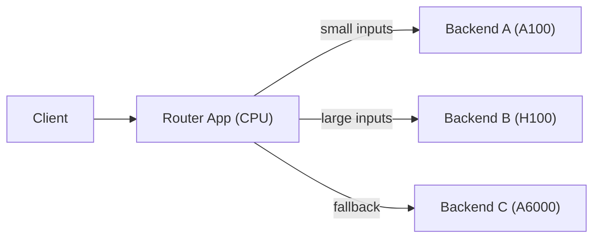

> ## Documentation Index
> Fetch the complete documentation index at: https://fal.ai/docs/llms.txt
> Use this file to discover all available pages before exploring further.

# Multi-App Routing

> Use a lightweight proxy app to route requests between multiple fal apps based on input characteristics.

As your workloads grow more complex, you may need different GPU types for different inputs, want to A/B test model versions, or orchestrate multi-step pipelines across specialized apps. Multi-app routing lets you deploy a lightweight CPU app as a router that inspects incoming requests and forwards them to the right backend. Each backend runs independently on its own machine type, scaling configuration, and model version.

The pattern is simple: deploy your backend apps normally, then deploy a CPU-only router app that uses [`FAL_KEY`](/documentation/development/environment-variables#authentication) (auto-injected into every runner) to call the backends via the fal client SDK. The router runs on cheap CPU instances and adds minimal latency, while each backend scales independently based on its own traffic. For simpler cases where you just want requests routed to runners that already have the right model loaded, see [Optimize Routing Behavior](/documentation/serverless/optimizations/optimize-routing-behavior) instead.

## When to Use

* **Route by GPU requirements** -- Send small inputs to A100, large inputs to H100
* **Route by model variant** -- Different LoRA adapters, different base models
* **A/B testing** -- Split traffic between model versions
* **Multi-step pipelines** -- Orchestrate a chain of apps (preprocess, generate, postprocess)
* **Fallback routing** -- Try one app, fall back to another on failure
* **Cost optimization** -- Route simple requests to cheaper machines, complex ones to expensive

## How It Works



1. Deploy multiple backend apps, each on a specific machine type
2. Deploy a lightweight CPU router app that accepts all requests
3. The router inspects the input and calls the appropriate backend via `fal_client`
4. `FAL_KEY` is auto-injected into every runner, so the router can call other fal apps without hardcoding credentials

***

## Example: Route by Input Size

Three apps: a CPU router and two GPU backends for different resolutions.

### Backend Apps

```python theme={null}
# backend_standard.py
import fal
from fal.toolkit import Image

class ImageGenStandard(fal.App):
    machine_type = "GPU-A100"

    def setup(self):
        from diffusers import StableDiffusionXLPipeline
        import torch
        self.pipe = StableDiffusionXLPipeline.from_pretrained(
            "stabilityai/stable-diffusion-xl-base-1.0",
            torch_dtype=torch.float16,
        ).to("cuda")

    @fal.endpoint("/")
    def generate(self, prompt: str, width: int = 1024, height: int = 1024) -> dict:
        image = self.pipe(prompt, width=width, height=height).images[0]
        return {"image": Image.from_pil(image)}
```

```python theme={null}
# backend_highres.py
import fal
from fal.toolkit import Image

class ImageGenHighRes(fal.App):
    machine_type = "GPU-H100"

    def setup(self):
        from diffusers import StableDiffusionXLPipeline
        import torch
        self.pipe = StableDiffusionXLPipeline.from_pretrained(
            "stabilityai/stable-diffusion-xl-base-1.0",
            torch_dtype=torch.float16,
        ).to("cuda")

    @fal.endpoint("/")
    def generate(self, prompt: str, width: int = 2048, height: int = 2048) -> dict:
        image = self.pipe(prompt, width=width, height=height).images[0]
        return {"image": Image.from_pil(image)}
```

Deploy both:

```bash theme={null}
fal deploy backend_standard.py::ImageGenStandard --app-name image-gen-standard
fal deploy backend_highres.py::ImageGenHighRes --app-name image-gen-highres
```

### Router App

```python theme={null}
# router.py
import fal
import fal_client

STANDARD_THRESHOLD = 1024 * 1024  # 1 megapixel

class ImageRouter(fal.App):
    machine_type = "S"  # Lightweight CPU -- just routing, no GPU needed
    requirements = ["fal-client"]

    @fal.endpoint("/")
    def route(self, prompt: str, width: int = 1024, height: int = 1024) -> dict:
        total_pixels = width * height

        if total_pixels <= STANDARD_THRESHOLD:
            app_id = "your-username/image-gen-standard"
        else:
            app_id = "your-username/image-gen-highres"

        result = fal_client.subscribe(app_id, arguments={
            "prompt": prompt,
            "width": width,
            "height": height,
        })

        return result
```

```bash theme={null}
fal deploy router.py::ImageRouter --app-name image-router
```

Users call `image-router` -- it routes to the right backend automatically.

***

## Example: A/B Testing

Split traffic between two model versions:

```python theme={null}
import fal
import fal_client
import random

class ABTestRouter(fal.App):
    machine_type = "S"
    requirements = ["fal-client"]

    @fal.endpoint("/")
    def route(self, prompt: str) -> dict:
        # 80% to stable version, 20% to experimental
        if random.random() < 0.8:
            app_id = "your-username/model-v1"
        else:
            app_id = "your-username/model-v2"

        result = fal_client.subscribe(app_id, arguments={
            "prompt": prompt,
        })

        # Include which version was used in the response
        result["model_version"] = app_id
        return result
```

***

## Example: Multi-Step Pipeline

Chain multiple apps together:

```python theme={null}
import fal
import fal_client

class PipelineRouter(fal.App):
    machine_type = "S"
    requirements = ["fal-client"]

    @fal.endpoint("/")
    def run_pipeline(self, image_url: str) -> dict:
        # Step 1: Upscale
        upscaled = fal_client.subscribe(
            "fal-ai/real-esrgan",
            arguments={"image_url": image_url, "scale": 4}
        )

        # Step 2: Remove background
        result = fal_client.subscribe(
            "fal-ai/birefnet",
            arguments={"image_url": upscaled["image"]["url"]}
        )

        return result
```

***

## Trade-offs

| Consideration  | Detail                                                                                                                           |
| -------------- | -------------------------------------------------------------------------------------------------------------------------------- |
| **Latency**    | Adds one hop through the CPU router. The router itself is fast (no GPU, no model loading), so overhead is typically under 100ms. |
| **Cost**       | The CPU router is very cheap (`S` machine type). The savings from routing to the right GPU often outweigh the router cost.       |
| **Complexity** | You manage multiple apps instead of one. Use clear naming conventions and environments.                                          |
| **Scaling**    | Each backend scales independently. The router can have high `max_multiplexing` since it's just forwarding requests.              |

<Tip>
  Set `max_multiplexing` high on the router app (e.g., 50+) since it's just making HTTP calls and doesn't need exclusive resources per request.
</Tip>

## Related

<CardGroup cols={2}>
  <Card title="Optimize Routing Behavior" icon="arrow-right" href="/documentation/serverless/optimizations/optimize-routing-behavior">
    Route requests within a single app using runner hints
  </Card>

  <Card title="Environment Variables" icon="arrow-right" href="/documentation/development/environment-variables">
    FAL\_KEY is auto-injected for calling other fal apps
  </Card>
</CardGroup>
