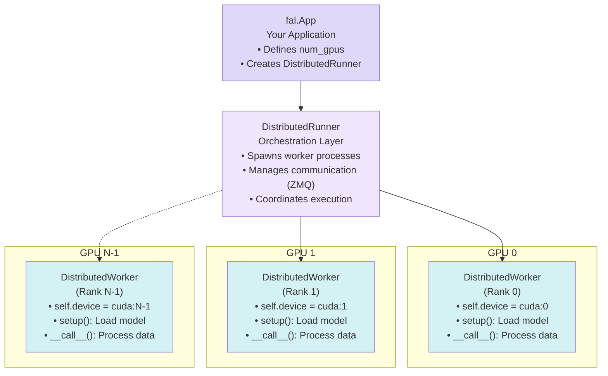

> ## Documentation Index
> Fetch the complete documentation index at: https://fal.ai/docs/llms.txt
> Use this file to discover all available pages before exploring further.

# Overview

> Learn how to leverage multiple GPUs for faster inference and training with fal.distributed

The `fal.distributed` module enables you to scale your AI workloads across multiple GPUs, dramatically improving performance for both inference and training tasks. Whether you need to generate multiple images simultaneously or train large models faster, distributed computing on fal makes it straightforward.

<Frame>
  <iframe className="w-full aspect-video rounded-lg" srcdoc="<style>*{padding:0;margin:0;overflow:hidden}html,body{height:100%}img,span{position:absolute;width:100%;top:0;bottom:0;margin:auto}span{height:1.5em;text-align:center;font:48px/1.5 sans-serif;color:white;text-shadow:0 0 0.5em black}</style><a href='https://www.youtube.com/embed/gDJJ9bppyV8?start=1111&end=1195&autoplay=1'><span>▶</span></a>" frameborder="0" allow="accelerometer; autoplay; clipboard-write; encrypted-media; gyroscope; picture-in-picture; web-share" allowfullscreen />
</Frame>

## Why Use Multiple GPUs?

### For Inference

* **Higher Throughput**: Generate multiple outputs simultaneously (e.g., 4 images at once on 4 GPUs)
* **Faster Single Output**: Split large models across GPUs for faster generation
* **Cost Efficiency**: Maximize GPU utilization for batch processing

### For Training

* **Faster Training**: Distribute training across multiple GPUs with synchronized gradient updates
* **Larger Batches**: Train with bigger batch sizes for better model convergence
* **Parallel Preprocessing**: Speed up data preprocessing by distributing it across GPUs

## Core Concepts

### Architecture Overview

Here's how the distributed computing components work together:



### DistributedRunner

The `DistributedRunner` is the main orchestration class that manages multi-GPU workloads. It handles process management, inter-process communication via ZMQ, and coordination between worker processes.

#### Key Methods

**`DistributedRunner(worker_cls, world_size)`**
Creates a runner that will spawn `world_size` instances of your `worker_cls`.

**`await runner.start(**kwargs)`**
Launches all worker processes and calls their `setup()` method. Any `**kwargs` are passed to each worker's setup. Call this once in your app's `setup()`.

**`await runner.invoke(payload)`**
Executes your worker's `__call__()` method with the given payload dict and returns the final result. Use this for standard (non-streaming) requests.

**`runner.stream(payload, as_text_events=True)`**
Returns an async iterator that streams intermediate results from workers. Use this with `StreamingResponse` for real-time progress updates.

#### Example Usage

```python theme={null}
from fal.distributed import DistributedRunner, DistributedWorker

class MyWorker(DistributedWorker):
    def setup(self, model_path):
        # Load model on this GPU (called once per worker)
        self.model = load_model(model_path).to(self.device)
    
    def __call__(self, prompt, **kwargs):
        # Process request (called for each request)
        return self.model.generate(prompt)

class MyApp(fal.App):
    num_gpus = 4  # Use 4 GPUs
    
    async def setup(self):
        # Create and start the runner
        self.runner = DistributedRunner(
            worker_cls=MyWorker,
            world_size=self.num_gpus
        )
        await self.runner.start(model_path="/data/model")
    
    @fal.endpoint("/")
    async def run(self, request: MyRequest):
        # Invoke workers for each request
        result = await self.runner.invoke({
            "prompt": request.prompt,
        })
        return result
```

<Info>
  For complete API documentation with all parameters and examples, see the [DistributedRunner API Reference](/serverless/distributed/api-reference#distributedrunner).
</Info>

### DistributedWorker

Your custom worker class extends `DistributedWorker` and runs on each GPU. Each worker is independent and has its own copy of the model.

#### Methods to Override

**`def setup(self, **kwargs)`**
Called once when the worker initializes. Load your model, download weights, and prepare resources here. Receives any `**kwargs` passed to `runner.start()`.

**`def __call__(self, streaming=False, **kwargs)`**
Called for each request. Implement your inference or training logic here. Receives the payload dict from `runner.invoke()` or `runner.stream()` as `**kwargs`.

#### Properties You'll Use

**`self.device`** - The PyTorch CUDA device for this worker (`cuda:0`, `cuda:1`, etc.)

**`self.rank`** - The worker's rank (0 to world\_size-1). Rank 0 is typically responsible for returning results.

**`self.world_size`** - Total number of workers (GPUs).

#### Utility Methods

**`self.add_streaming_result(data, as_text_event=True)`**
Sends intermediate results to the client during streaming. Only call from rank 0 to avoid duplicates.

**`self.rank_print(message)`**
Prints a message with the worker's rank prefix for easier debugging.

<Info>
  For complete API documentation with detailed examples, see the [DistributedWorker API Reference](/serverless/distributed/api-reference#distributedworker).
</Info>

### PyTorch Distributed Primitives

For training and coordinated inference, you can use PyTorch's distributed primitives:

```python theme={null}
import torch.distributed as dist

# Gather results from all GPUs to rank 0
dist.gather(tensor, gather_list if self.rank == 0 else None, dst=0)

# Broadcast data from rank 0 to all GPUs
dist.broadcast(tensor, src=0)

# Synchronize all GPUs at a barrier
dist.barrier()
```

## Parallelism Strategies

### Inference Strategies

Different parallelism strategies optimize for different inference scenarios. Choose based on your use case and model architecture.

<CardGroup cols={2}>
  <Card title="Data Parallelism" icon="layer-group">
    Each GPU runs an independent model copy with different inputs. Best for high throughput scenarios where you need to generate multiple outputs simultaneously.

    **Use for:** Batch processing, generating multiple image variations, high throughput workloads\
    **Example:** Parallel SDXL in fal-demos
  </Card>

  <Card title="Pipeline Parallelism (PipeFusion)" icon="diagram-project">
    Split the model into sequential stages across GPUs, processing like an assembly line where each GPU handles specific layers. Reduces latency for single outputs.

    **Use for:** Large DiT models (SD3, FLUX), reducing latency for single image generation\
    **Example:** xFuser's PipeFusion implementation for DiT models
  </Card>

  <Card title="Tensor Parallelism" icon="grid">
    Split individual layers and tensors across GPUs, computing portions of each layer in parallel. Required when models are too large to fit on a single GPU.

    **Use for:** Extremely large models that don't fit on single GPU memory\
    **Example:** Large language models, very large diffusion models
  </Card>

  <Card title="Sequence Parallelism (Ulysses)" icon="timeline">
    Split attention computation across the sequence or spatial dimensions. Particularly effective for long sequences and can be combined with other strategies.

    **Use for:** Very long sequences, high-resolution images, combining with PipeFusion\
    **Example:** xFuser's Ulysses implementation
  </Card>

  <Card title="CFG Parallelism" icon="split">
    Parallel conditional and unconditional passes for classifier-free guidance. Runs both guidance passes simultaneously on separate GPUs.

    **Use for:** U-Net models (SDXL), requires exactly 2 GPUs\
    **Example:** xFuser supports this for U-Net architectures
  </Card>

  <Card title="Hybrid Strategies" icon="sitemap">
    Combine multiple approaches (e.g., PipeFusion + Ulysses + CFG) for maximum scaling efficiency across many GPUs.

    **Use for:** Maximum scaling across 4-8+ GPUs, complex production workloads\
    **Example:** xFuser configurations for 8 GPU setups
  </Card>
</CardGroup>

### Training Strategies

Multi-GPU training strategies focus on distributing the computational and memory requirements of training large models.

<CardGroup cols={2}>
  <Card title="Distributed Data Parallel (DDP)" icon="server">
    Each GPU has a full model copy and processes different data batches. Gradients are synchronized across all GPUs after each backward pass, ensuring all models stay identical.

    **Use for:** Standard multi-GPU training, best scaling for most use cases\
    **Example:** Flux LoRA training in fal-demos
  </Card>

  <Card title="Pipeline Parallelism" icon="pipe">
    Split model into stages and process microbatches through the pipeline. Requires careful load balancing to avoid GPU idle time (bubble overhead).

    **Use for:** Very large models, when combined with other parallelism strategies\
    **Example:** GPT-3 style training
  </Card>

  <Card title="Tensor Parallelism" icon="cubes">
    Split model layers across GPUs using Megatron-LM style parallelization. Each layer's computation is distributed across multiple GPUs.

    **Use for:** Models too large for single GPU even with gradient checkpointing\
    **Example:** Large transformer training
  </Card>

  <Card title="FSDP/ZeRO" icon="memory">
    Fully Sharded Data Parallel (FSDP) or ZeRO optimizer shard optimizer states, gradients, and parameters across GPUs to reduce memory footprint per GPU.

    **Use for:** Training very large models with memory constraints, scaling beyond DDP\
    **Example:** Large model training (70B+ parameters)
  </Card>
</CardGroup>

<Note>
  Many production workloads benefit from hybrid strategies. For example, xFuser can combine PipeFusion + Ulysses + CFG parallelism to scale across 8+ GPUs efficiently.
</Note>

## Configuration

### Specifying GPU Count

```python theme={null}
class MyApp(fal.App):
    num_gpus = 8  # Request 8 GPUs
    machine_type = "GPU-H100"  # Each GPU will be an H100
```

### Multi-GPU Machine Types

fal supports various multi-GPU configurations:

* `GPU-H100` with `num_gpus=2`: 2x H100 GPUs
* `GPU-H100` with `num_gpus=4`: 4x H100 GPUs
* `GPU-H100` with `num_gpus=8`: 8x H100 GPUs
* `GPU-A100` with `num_gpus=2/4/8`: 2-8x A100 GPUs

## Examples

All examples are available in the [fal-demos repository](https://github.com/fal-ai-community/fal-demos/tree/main/fal_demos/distributed):

* **Parallel SDXL**: Data parallelism for image generation ([code](https://github.com/fal-ai-community/fal-demos/blob/main/fal_demos/distributed/inference/parallel_sdxl/app.py))
* **xFuser**: Model parallelism with DiT models ([code](https://github.com/fal-ai-community/fal-demos/blob/main/fal_demos/distributed/inference/xfuser/app.py))
* **Flux LoRA Training**: Complete DDP training pipeline ([code](https://github.com/fal-ai-community/fal-demos/tree/main/fal_demos/distributed/training/flux_lora))

## Next Steps

<CardGroup cols={2}>
  <Card title="API Reference" icon="book" href="/serverless/distributed/api-reference">
    Complete API documentation for DistributedRunner and DistributedWorker
  </Card>

  <Card title="Multi-GPU Inference Tutorial" icon="bolt" href="/serverless/tutorials/deploy-multi-gpu-inference">
    Step-by-step guide with parallel SDXL
  </Card>

  <Card title="Multi-GPU Training Tutorial" icon="graduation-cap" href="/serverless/tutorials/deploy-multi-gpu-training">
    Build a distributed Flux LoRA training service
  </Card>

  <Card title="Event Streaming" icon="signal-stream" href="/serverless/distributed/streaming">
    Stream intermediate results from workers
  </Card>
</CardGroup>

## Additional Resources

* [fal-demos distributed examples](https://github.com/fal-ai-community/fal-demos/tree/main/fal_demos/distributed) - Complete working code
* [Python SDK Reference](/serverless/python/api-reference) - Full Python API
* [App Lifecycle](/documentation/development/app-lifecycle) - How apps are structured and how runners start up and shut down
