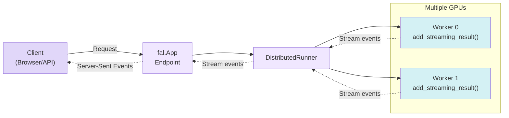

> ## Documentation Index
> Fetch the complete documentation index at: https://fal.ai/docs/llms.txt
> Use this file to discover all available pages before exploring further.

# Event Streaming

> Learn how to stream real-time results during distributed inference and training

Streaming allows you to send intermediate results from your distributed workers back to the client in real-time. This is particularly useful for long-running operations like image generation, video creation, or model training where users benefit from seeing progress updates.

<Note>
  For a complete working example of streaming with multi-GPU inference, see the [Parallel SDXL Tutorial](/serverless/tutorials/deploy-multi-gpu-inference).
</Note>

## How Streaming Works

With `fal.distributed`, you can stream results from workers during execution:



## Basic Streaming Example

### 1. Stream from Workers

In your `DistributedWorker`, use `add_streaming_result()` to send intermediate results:

```python theme={null}
from fal.distributed import DistributedWorker
import torch.distributed as dist

class StreamingWorker(DistributedWorker):
    def __call__(self, prompt: str, steps: int = 20):
        for step in range(steps):
            # Do some processing
            result = self.model.step(prompt)
            
            # Only rank 0 streams to avoid duplicates
            if self.rank == 0:
                self.add_streaming_result({
                    "step": step,
                    "progress": (step + 1) / steps,
                    "message": f"Processing step {step + 1}/{steps}"
                }, as_text_event=True)
        
        # Return final result
        return {"output": final_result}
```

**Key points:**

* `add_streaming_result()`: Sends data to the client
* `as_text_event=True`: Formats as Server-Sent Events (SSE)
* Only rank 0 should stream to avoid duplicate messages

### 2. Create Streaming Endpoint

Define an endpoint that returns a `StreamingResponse`:

```python theme={null}
import fal
from fal.distributed import DistributedRunner
from fastapi.responses import StreamingResponse

class MyApp(fal.App):
    num_gpus = 2
    
    def setup(self):
        self.runner = DistributedRunner(
            worker_cls=StreamingWorker,
            world_size=self.num_gpus,
        )
    
    @fal.endpoint("/stream")
    async def stream(self, request: MyRequest) -> StreamingResponse:
        """Endpoint that streams results"""
        return StreamingResponse(
            self.runner.stream(
                request.dict(),
                as_text_events=True,
            ),
            media_type="text/event-stream",
        )
```

### 3. Consume Stream from Client

**JavaScript/TypeScript:**

```javascript theme={null}
const response = await fetch('https://your-app.fal.run/stream', {
  method: 'POST',
  headers: { 'Content-Type': 'application/json' },
  body: JSON.stringify({ prompt: "A sunset", steps: 20 })
});

const reader = response.body.getReader();
const decoder = new TextDecoder();

while (true) {
  const { done, value } = await reader.read();
  if (done) break;
  
  const text = decoder.decode(value);
  const events = text.split('\n\n');
  
  for (const event of events) {
    if (event.startsWith('data: ')) {
      const data = JSON.parse(event.slice(6));
      console.log(`Step ${data.step}: ${data.progress * 100}%`);
    }
  }
}
```

**Python:**

```python theme={null}
import fal_client

for event in fal_client.stream(
    "username/app-name",
    arguments={"prompt": "A sunset", "steps": 20}
    # path="/stream"  # Optional: defaults to "/stream", change if your endpoint uses a different path
):
    print(f"Step {event['step']}: {event['progress'] * 100}%")
```

<Note>
  If your endpoint uses a path other than `/stream`, specify it with the `path` parameter to match your `@fal.endpoint()` decorator.
</Note>

## Advanced: Streaming with Gather

Stream intermediate results from all GPUs and combine them:

```python theme={null}
class MultiGPUStreamingWorker(DistributedWorker):
    def __call__(self, prompt: str, num_steps: int = 20):
        for step in range(0, num_steps, 5):  # Stream every 5 steps
            # Generate intermediate result on this GPU
            intermediate = self.model.step(prompt)
            
            # Gather from all workers
            if self.rank == 0:
                gather_list = [
                    torch.zeros_like(intermediate, device=self.device)
                    for _ in range(self.world_size)
                ]
            else:
                gather_list = None
            
            dist.gather(intermediate, gather_list, dst=0)
            
            # Only rank 0 streams the combined result
            if self.rank == 0:
                combined = self.combine_results(gather_list)
                self.add_streaming_result({
                    "step": step,
                    "preview": combined,
                    "num_gpus": self.world_size,
                }, as_text_event=True)
            
            # Synchronize before next step
            dist.barrier()
        
        return {"final": final_result}
```

## Best Practices

### 1. Stream Only from Rank 0

Avoid duplicate messages by only streaming from the main worker:

```python theme={null}
if self.rank == 0:
    self.add_streaming_result(data, as_text_event=True)
```

### 2. Throttle Stream Frequency

Don't stream on every iteration - use intervals:

```python theme={null}
if step % 5 == 0:  # Every 5 steps
    self.add_streaming_result(...)
```

### 3. Use Synchronization

Synchronize workers after streaming to maintain consistency:

```python theme={null}
if self.rank == 0:
    self.add_streaming_result(data, as_text_event=True)

dist.barrier()  # Wait for all workers
```

### 4. Keep Payloads Small

Stream minimal data for responsiveness:

```python theme={null}
# Good: Small progress updates
self.add_streaming_result({
    "step": step,
    "progress": 0.5,
})

# Avoid: Large data in every update
# self.add_streaming_result({"large_array": [...]})
```

### 5. Handle Images Efficiently

For streaming images, use base64 encoding:

```python theme={null}
import base64
import io

# Convert PIL image to base64
buffer = io.BytesIO()
image.save(buffer, format="JPEG")
image_b64 = base64.b64encode(buffer.getvalue()).decode()

self.add_streaming_result({
    "preview": f"data:image/jpeg;base64,{image_b64}"
}, as_text_event=True)
```

## Complete Example

See the [Multi-GPU Inference Tutorial](/serverless/tutorials/deploy-multi-gpu-inference) for a complete working example with streaming, including:

* Real-time preview generation
* Progress updates every 5 steps
* Gathering results from multiple GPUs
* Progressive blur effects during generation

## Next Steps

<CardGroup cols={2}>
  <Card title="Multi-GPU Inference Tutorial" icon="bolt" href="/serverless/tutorials/deploy-multi-gpu-inference">
    Complete streaming example with SDXL
  </Card>

  <Card title="Real-time Endpoints" icon="signal-stream" href="/serverless/development/realtime">
    Learn about fal's real-time framework
  </Card>
</CardGroup>
